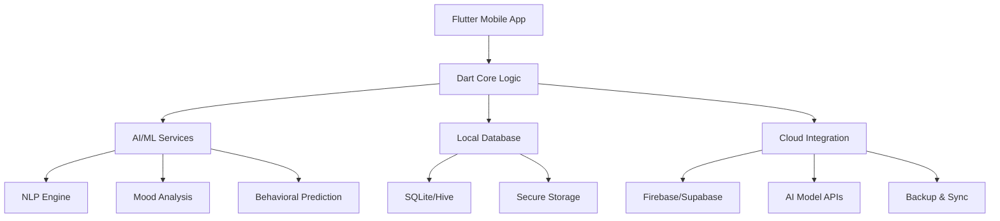

# 🧠 Mental Health AI - Flutter Application

<div align="center">


**🌱 Your Personal Digital Wellness Companion**

[](https://flutter.dev/)
[](https://dart.dev/)
[](https://github.com/AmlanWTK/MenatalHealthApplication)
[](#)


*"Your mental health matters. Let AI be your compassionate companion on the journey to wellness."*

</div>

---

## 🌟 About This Project

**Mental Health AI** is a comprehensive Flutter application designed to revolutionize personal mental wellness through the power of artificial intelligence. This app combines evidence-based therapeutic techniques with cutting-edge AI technology to provide users with personalized, accessible, and stigma-free mental health support available 24/7.

### 🎯 **Mission & Vision**
- **Democratize Mental Healthcare**: Make quality mental health support accessible to everyone
- **AI-Driven Personalization**: Provide tailored recommendations based on individual patterns
- **Stigma-Free Support**: Create a safe, private space for mental health exploration
- **Evidence-Based Care**: Integrate proven therapeutic methodologies with modern technology

---

## ✨ Key Features

<table>
<tr>
<td width="33%" align="center">

### 🤖 **AI Therapy Companion**


**Intelligent Therapeutic Support**
- 24/7 AI-powered conversations
- Cognitive Behavioral Therapy (CBT) techniques
- Natural Language Processing for empathy
- Crisis detection and intervention
- Personalized coping strategies

</td>
<td width="33%" align="center">

### 📊 **Mood Analytics**


**Smart Emotional Intelligence**
- Advanced mood tracking and pattern analysis
- Sentiment analysis of journal entries
- Predictive mental health insights
- Visual progress dashboards
- Trigger identification and alerts

</td>
<td width="33%" align="center">

### 🧘 **Wellness Ecosystem**


**Holistic Mental Health Toolkit**
- Guided meditation and mindfulness
- Breathing exercises with biofeedback
- Sleep hygiene and tracking
- Stress management techniques
- Habit formation and goal setting

</td>
</tr>
</table>

### 🏥 **Comprehensive Mental Health Suite**

<details>
<summary><b>🔍 Explore All Features</b></summary>

| Feature Category | Core Capabilities | AI Enhancement |
|-----------------|-------------------|----------------|
| **🤖 AI Chatbot** | Therapeutic conversations, CBT/DBT techniques | Natural Language Understanding, Emotional Intelligence |
| **📝 Mood Tracking** | Daily mood logging, pattern recognition | Sentiment analysis, predictive modeling |
| **🧘 Mindfulness** | Meditation library, breathing exercises | Personalized session recommendations |
| **📊 Analytics** | Progress visualization, trend analysis | Machine learning insights, risk assessment |
| **🚨 Crisis Support** | Emergency resources, hotline access | Real-time risk detection, immediate intervention |
| **👥 Community** | Peer support groups, shared experiences | AI moderation, safe space maintenance |
| **📚 Resources** | Educational content, coping strategies | Adaptive learning, personalized content |
| **🔒 Privacy** | End-to-end encryption, anonymous mode | Secure AI processing, HIPAA compliance |

</details>

---

## 🛠️ Technology Architecture

<div align="center">

### System Architecture Overview


</div>

### 🚀 **Technical Stack**

| Component | Technology | Purpose | AI Integration |
|-----------|------------|---------|----------------|
| **📱 Framework** |  | Cross-platform mobile development | Native AI model integration |
| **💻 Language** |  | Primary programming language | Async AI processing |
| **🧠 AI/ML** |  | Machine learning models | On-device inference |
| **💬 NLP** |  | Natural language processing | Sentiment analysis |
| **🗄️ Database** |  | Local data storage | AI training data |
| **☁️ Backend** |  | Cloud services & authentication | AI model hosting |
| **🔒 Security** |  | End-to-end encryption | Secure AI processing |

### 🏗️ **AI-Powered Features Architecture**

<table>
<tr>
<td width="50%">

#### **🧠 Machine Learning Pipeline**
- **Mood Prediction Models**: LSTM networks for emotional state forecasting
- **Sentiment Analysis**: BERT-based NLP for text understanding
- **Behavioral Pattern Recognition**: Clustering algorithms for habit analysis
- **Risk Assessment Models**: Ensemble methods for crisis prediction

</td>
<td width="50%">

#### **🤖 Intelligent Systems**
- **Conversational AI**: Fine-tuned language models for therapy
- **Recommendation Engine**: Collaborative filtering for personalized content
- **Adaptive Learning**: Reinforcement learning for user preference optimization
- **Real-time Analysis**: Edge computing for immediate insights

</td>
</tr>
</table>

---

## 📱 User Experience & Interface

### 🎨 **Design Philosophy**

<div align="center">

**"Technology with Empathy"** - Our design prioritizes emotional safety, accessibility, and therapeutic effectiveness.

</div>

<table>
<tr>
<td width="25%" align="center">

**🏠 Welcoming Home**
*Calming dashboard with AI-powered daily insights and quick access to support*

</td>
<td width="25%" align="center">

**💬 AI Therapist**
*Natural conversation interface with empathetic AI responses and therapeutic guidance*

</td>
<td width="25%" align="center">

**📊 Mood Journey**
*Beautiful data visualization showing emotional patterns and growth over time*

</td>
<td width="25%" align="center">

**🧘 Mindful Moments**
*Immersive meditation and mindfulness experiences with biofeedback integration*

</td>
</tr>
</table>

### 🎯 **User-Centered Design Principles**

<details>
<summary><b>🔍 UX Design Guidelines</b></summary>

#### **🌈 Therapeutic Color Psychology**
- **Calming Blues & Greens**: Reduce anxiety and promote tranquility
- **Warm Accent Colors**: Create feelings of hope and positivity
- **High Contrast Options**: Support users with visual impairments
- **Dark Mode Support**: Reduce eye strain during vulnerable moments

#### **♿ Accessibility First**
- **Screen Reader Compatibility**: Full VoiceOver and TalkBack support
- **Large Font Options**: Customizable text sizes for all users
- **Simple Navigation**: Intuitive interface reducing cognitive load
- **Crisis Mode**: One-touch access to emergency resources

#### **🔒 Privacy-by-Design**
- **Anonymous Mode**: Use app without personal identifiers
- **Local Processing**: Keep sensitive data on device when possible
- **Granular Controls**: User chooses what data to share
- **Transparent AI**: Clear explanations of how AI makes decisions

</details>

---

## 🚀 Getting Started

### 📋 **Prerequisites**

<details>
<summary><b>Development Environment Setup</b></summary>

```bash
# Required Software
Flutter SDK: >=3.10.0
Dart SDK: >=3.0.0
Android Studio / Xcode
Git
Python 3.8+ (for AI model training)
```

**AI/ML Dependencies:**
```bash
# TensorFlow Lite for mobile AI
tensorflow: ^2.13.0
tflite: ^1.1.2

# Natural Language Processing
google_ml_kit: ^0.16.0
speech_to_text: ^6.3.0
```

</details>

### ⚡ **Quick Installation**

<details>
<summary><b>Click to expand installation guide</b></summary>

1. **Clone the repository**
   ```bash
   git clone https://github.com/AmlanWTK/MenatalHealthApplication.git
   cd MenatalHealthApplication
   ```

2. **Install Flutter dependencies**
   ```bash
   flutter pub get
   ```

3. **Set up AI services**
   ```bash
   # Configure Google Cloud NLP
   cp .env.example .env
   # Add your API keys to .env file
   ```

4. **Initialize local database**
   ```bash
   flutter packages pub run build_runner build
   ```

5. **Run the application**
   ```bash
   flutter run
   ```

6. **Build for production**
   ```bash
   # Android
   flutter build apk --release
   
   # iOS
   flutter build ios --release
   ```

</details>

---

## 📂 Project Structure

```
mental_health_ai/
├── 📱 lib/
│   ├── 🏠 main.dart                    # Application entry point
│   ├── 🧠 core/
│   │   ├── ai/                         # AI/ML services
│   │   │   ├── chatbot_service.dart    # Therapeutic AI chatbot
│   │   │   ├── mood_analyzer.dart      # Emotion recognition
│   │   │   ├── sentiment_analysis.dart # NLP processing
│   │   │   └── risk_assessment.dart    # Crisis prediction
│   │   ├── database/                   # Data management
│   │   │   ├── mood_database.dart      # Mood tracking storage
│   │   │   ├── chat_history.dart       # Conversation persistence
│   │   │   └── user_preferences.dart   # Settings & customization
│   │   └── utils/                      # Helper functions
│   ├── 🎨 presentation/
│   │   ├── screens/
│   │   │   ├── home_screen.dart        # Main dashboard
│   │   │   ├── chat_screen.dart        # AI therapy interface
│   │   │   ├── mood_tracker.dart       # Emotion logging
│   │   │   ├── analytics_screen.dart   # Progress visualization
│   │   │   ├── meditation_screen.dart  # Mindfulness exercises
│   │   │   ├── crisis_support.dart     # Emergency resources
│   │   │   └── settings_screen.dart    # User preferences
│   │   └── widgets/
│   │       ├── ai_chat_bubble.dart     # Conversational UI
│   │       ├── mood_selector.dart      # Emotion input widget
│   │       ├── progress_chart.dart     # Data visualization
│   │       └── breathing_exercise.dart # Guided breathing
│   ├── 💾 data/
│   │   ├── models/
│   │   │   ├── mood_entry.dart         # Emotion data structure
│   │   │   ├── chat_message.dart       # Conversation models
│   │   │   └── user_profile.dart       # Personal information
│   │   └── repositories/
│   │       ├── mood_repository.dart    # Mood data management
│   │       └── ai_repository.dart      # AI service interfaces
│   └── 🔧 services/
│       ├── notification_service.dart   # Reminder system
│       ├── backup_service.dart         # Data synchronization
│       └── analytics_service.dart      # Usage tracking
├── 🤖 assets/
│   ├── ai_models/                      # TensorFlow Lite models
│   │   ├── mood_classifier.tflite      # Emotion recognition
│   │   ├── risk_predictor.tflite       # Crisis detection
│   │   └── sentiment_analyzer.tflite   # Text analysis
│   ├── 🖼️ images/                      # UI graphics & illustrations
│   ├── 🎵 audio/                       # Meditation & breathing guides
│   └── 📄 data/
│       ├── coping_strategies.json      # Therapeutic resources
│       ├── meditation_scripts.json     # Guided sessions
│       └── crisis_resources.json       # Emergency contacts
├── 📊 test/
│   ├── unit/                          # Unit tests
│   ├── integration/                   # Integration tests
│   └── ai_model_tests/               # ML model validation
└── 📋 pubspec.yaml                   # Dependencies & configuration
```

---

## 🧠 AI & Machine Learning Features

### 🤖 **Conversational AI Therapist**

<table>
<tr>
<td width="50%">

#### **🎭 Therapeutic Techniques**
- **Cognitive Behavioral Therapy (CBT)**: AI guides users through thought pattern analysis
- **Dialectical Behavior Therapy (DBT)**: Emotional regulation and distress tolerance
- **Mindfulness-Based Interventions**: Present-moment awareness exercises  
- **Solution-Focused Therapy**: Goal-oriented problem-solving conversations

</td>
<td width="50%">

#### **🧠 AI Capabilities**
- **Emotional Intelligence**: Recognizes and responds to user emotional states
- **Context Awareness**: Remembers conversation history and user preferences
- **Crisis Recognition**: Identifies high-risk situations and responds appropriately
- **Adaptive Learning**: Improves responses based on user feedback and outcomes

</td>
</tr>
</table>

### 📊 **Predictive Mental Health Analytics**

```dart
// Example: AI-powered mood prediction
class MoodPredictor {
  TensorFlowLite moodModel;
  
  Future<MoodPrediction> predictMoodTrend(UserData userData) async {
    // Process historical mood data, sleep patterns, activity levels
    final prediction = await moodModel.runInference([
      userData.moodHistory,
      userData.sleepPattern,
      userData.activityLevel,
      userData.stressFactors
    ]);
    
    return MoodPrediction(
      predictedMood: prediction.mood,
      confidenceLevel: prediction.confidence,
      riskFactors: prediction.identifiedRisks,
      recommendations: generateRecommendations(prediction)
    );
  }
}
```

### 🔍 **Advanced Analytics Dashboard**

<details>
<summary><b>📈 AI-Driven Insights</b></summary>

#### **🎯 Personalized Metrics**
- **Mood Volatility Index**: AI calculates emotional stability patterns
- **Stress Correlation Analysis**: Identifies relationships between life events and mood
- **Recovery Time Prediction**: Estimates time needed for emotional regulation
- **Intervention Effectiveness**: Measures success of different coping strategies

#### **🚨 Early Warning System**
- **Depression Risk Scoring**: ML models assess depression likelihood
- **Anxiety Spike Prediction**: Anticipates anxiety episodes before they occur
- **Sleep-Mood Correlation**: Tracks relationship between rest and mental state
- **Social Isolation Detection**: Monitors changes in social interaction patterns

</details>

---

## 🔒 Privacy & Security

### 🛡️ **Data Protection Framework**

<div align="center">

**"Your mental health data is sacred. We protect it like our own."**

</div>

<table>
<tr>
<td width="50%">

#### **🔐 Technical Security**
- **AES-256 Encryption**: Military-grade data protection
- **End-to-End Encryption**: Messages secured from device to device
- **Local AI Processing**: Sensitive analysis happens on your device
- **Secure Key Management**: Hardware security module integration
- **Biometric Authentication**: Fingerprint/face unlock options

</td>
<td width="50%">

#### **📋 Compliance & Ethics**
- **HIPAA Compliance**: Healthcare data protection standards
- **GDPR Ready**: European privacy regulation compliance
- **Ethical AI Framework**: Transparent, fair, and unbiased algorithms
- **Data Minimization**: Collect only necessary information
- **User Control**: Granular privacy settings and data deletion

</td>
</tr>
</table>

### 🏥 **Clinical & Ethical Guidelines**

<details>
<summary><b>🔍 Professional Standards</b></summary>

#### **⚖️ Ethical AI Development**
- **Algorithmic Transparency**: Clear explanations of AI decision-making
- **Bias Mitigation**: Regular testing for fairness across demographics  
- **Human Oversight**: Licensed mental health professionals review AI recommendations
- **Continuous Monitoring**: Ongoing assessment of AI safety and effectiveness

#### **🩺 Clinical Integration**
- **Professional Referrals**: AI recognizes when human intervention is needed
- **Emergency Protocols**: Automatic routing to crisis helplines when appropriate
- **Evidence-Based Practice**: All AI recommendations based on peer-reviewed research
- **Outcome Tracking**: Measure and report therapeutic effectiveness

</details>

---

## 🤝 Contributing & Community

<div align="center">

**Join our mission to democratize mental healthcare through technology**

[](CONTRIBUTING.md)
[](https://discord.gg/mentalhealthai)

</div>

### 🛠️ **Ways to Contribute**

<table>
<tr>
<td width="25%" align="center">

#### **💻 Development**
- Feature development
- Bug fixes & optimization
- AI model improvements
- Security enhancements
- Testing & quality assurance

</td>
<td width="25%" align="center">

#### **🧠 Clinical Expertise**
- Therapeutic technique validation
- Clinical workflow improvement
- Evidence-based feature design
- Ethics review and guidance
- Professional integration feedback

</td>
<td width="25%" align="center">

#### **🎨 Design & UX**
- Therapeutic interface design
- Accessibility improvements
- User experience research
- Visual design and illustrations
- Interaction design patterns

</td>
<td width="25%" align="center">

#### **📚 Content & Research**
- Therapeutic content creation
- Mental health resources
- Translation and localization
- Research and validation
- Educational material development

</td>
</tr>
</table>

### 🔄 **Contribution Process**

1. 🍴 **Fork** the repository
2. 🌿 **Create** a feature branch (`git checkout -b feature/mental-health-improvement`)
3. 💍 **Commit** changes (`git commit -m 'Add therapeutic feature'`)
4. 📤 **Push** to branch (`git push origin feature/mental-health-improvement`)
5. 🎯 **Open** a Pull Request with detailed description

---

## 🏆 Recognition & Impact

### 📊 **Mental Health Statistics**

<div align="center">

| Global Impact | Statistics | Our Mission |
|---------------|------------|-------------|
| **Mental Health Disorders** | 970M people affected globally | Provide accessible AI support |
| **Treatment Gap** | 70% lack access to care | Bridge gap with technology |
| **Youth Mental Health** | 1 in 5 adolescents affected | Early intervention through AI |
| **Suicide Prevention** | 1 person every 40 seconds | AI-powered crisis detection |

*Source: WHO Global Health Observatory, 2024*

</div>

### 🌍 **Social Impact Goals**

- **🎯 Accessibility**: Make mental health support available to underserved communities
- **🔬 Research**: Contribute to mental health research through anonymized insights
- **📚 Education**: Reduce stigma through mental health literacy
- **🤝 Community**: Build supportive networks for mental wellness

---

## 📄 License & Usage

<div align="center">

[](https://opensource.org/licenses/MIT)

**MIT License © 2025 Mental Health AI**

</div>

### 📋 **Usage Guidelines**

- ✅ **Personal Use**: Free for individual mental health and wellness
- ✅ **Educational**: Encouraged for academic and research purposes  
- ✅ **Healthcare Integration**: Compatible with clinical practice systems
- ✅ **Open Source**: Contribute improvements back to the community
- ⚖️ **Clinical Disclaimer**: Not a replacement for professional medical advice

---

## 🔗 Resources & Support

<div align="center">

| Resource | Link | Description |
|----------|------|-------------|
| 📱 **App Store** | [Download Coming Soon](#) | Mobile app releases |
| 💬 **Community** | [Discord Server](https://discord.gg/mentalhealthai) | Support & discussions |
| 📚 **Documentation** | [Wiki](https://github.com/AmlanWTK/MenatalHealthApplication/wiki) | Technical guides |
| 🐛 **Issues** | [GitHub Issues](https://github.com/AmlanWTK/MenatalHealthApplication/issues) | Bug reports & features |
| 🚨 **Crisis Support** | [Emergency Resources](#crisis-resources) | Immediate help contacts |

[](https://github.com/AmlanWTK/MenatalHealthApplication)
[](https://github.com/AmlanWTK/MenatalHealthApplication)

</div>

---

## 💭 Mental Health Awareness

<div align="center">

> *"Mental health is not a destination, but a process. It's about how you drive, not where you're going."*  
> **- Noam Spencer**

> *"You don't have to be positive all the time. It's perfectly okay to feel sad, angry, annoyed, frustrated, scared, or anxious. Having feelings doesn't make you a negative person. It makes you human."*  
> **- Lori Deschene**

---

### 🌱 **Your Wellness Journey Starts Here**

**[🚀 Get Started](#-getting-started) • [💬 Join Community](https://discord.gg/mentalhealthai) • [🤝 Contribute](#-contributing--community)**

---

*Made with ❤️ for mental wellness and powered by compassionate AI*

**⭐ Star this repository to support accessible mental healthcare for everyone!**

### 🆘 Crisis Resources

**If you're in immediate danger or having thoughts of self-harm:**
- **🇺🇸 National Suicide Prevention Lifeline**: 988
- **🇺🇸 Crisis Text Line**: Text HOME to 741741  
- **🌍 International**: [Find local crisis resources](https://findahelpline.com)
- **🚨 Emergency Services**: Call your local emergency number

*This app is a supportive tool but not a replacement for professional medical care.*

</div>
